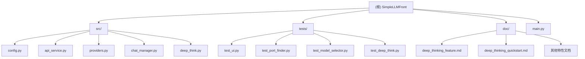

# CLAUDE.md

> 本文件为 Claude Code (claude.ai/code) 提供项目导航和开发指引

---

## 变更记录 (Changelog)

### 2025-12-03 (重构: 解耦 UI 层)

- ✅ **解耦 main.py**: 从 673 行简化到 55 行，仅保留启动逻辑
- ✅ **新增 UIClient**: `src/ui_client.py` (95 行)，作为总协调器
- ✅ **新增 UIComposer**: `src/ui_composer.py` (330 行)，纯 UI 布局构建
- ✅ **新增 EventHandlers**: `src/event_handlers.py` (260 行)，事件处理逻辑
- ✅ **新增 ResponseHandlers**: `src/response_handlers.py` (300 行)，响应处理逻辑
- ✅ **设计原则**: 遵循 SOLID 原则，职责分离，可测试性大幅提升
- ✅ **完全向后兼容**: 功能保持不变，代码更清晰易维护

### 2025-12-01 (新增 Kimi K2 系列模型)

- 在 src/config.py 中添加 Kimi K2 系列模型支持
- 新增 4 个 K2 模型: k2-0905-preview、k2-turbo-preview、k2-thinking、k2-thinking-turbo
- 更新文档说明 K2 系列模型的特点和用途

### 2025-12-01 (新增 Kimi 提供商支持)

- 在 src/providers.py 中添加 KimiProvider 类实现
- 在 src/config.py 中添加 Kimi 提供商配置和模型列表
- 更新 .env.example 添加 KIMI_API_KEY 配置示例
- 更新项目文档,记录 Kimi（月之暗面）提供商相关信息

### 2025-12-01 15:07:03

- 初始化AI上下文文档
- 添加模块结构图（Mermaid）
- 完善模块索引和架构说明
- 为所有核心模块生成本地CLAUDE.md

---

## 项目愿景

SimpleLLMFront (ThinkCloud for Web) 是一个多提供商 LLM 聊天客户端，旨在：

- 统一管理多个 AI 提供商（Cerebras、DeepSeek、OpenAI、DashScope、Kimi）
- 提供优雅的 Gradio Web 界面，支持高级参数配置
- 实现深度思考模式，通过多阶段推理解决复杂问题
- 采用模块化架构，易于扩展新提供商和功能

## 架构总览

### 技术栈

- **前端**: Gradio 4.x (Python Web UI 框架)
- **后端**: Python 3.8+
- **AI SDK**: Cerebras Cloud SDK, OpenAI SDK
- **配置管理**: python-dotenv
- **架构模式**: 工厂模式、单例模式、策略模式、MVC 模式（UI 层）

### UI 层重构架构（2025-12-03）

**重构前的问题**:

- `main.py` 673 行，包含 `LLMClient` 类（600+ 行）
- `LLMClient` 职责过多：UI 创建、事件处理、响应生成
- 事件处理器是嵌套函数，无法单独测试
- 代码耦合度高，难以维护和扩展

**重构后的架构**:

```
main.py (55 行)
    ↓（导入）
src/ui_client.py (95 行)
    ↓（组合）
    ├─ src/ui_composer.py (330 行) - UI 布局构建
    ├─ src/event_handlers.py (260 行) - 事件处理逻辑
    └─ src/response_handlers.py (300 行) - 响应处理逻辑
```

**模块职责分离**:

1. **UIClient** - 总协调器
    - 创建并管理 UIComposer、EventHandlers、ResponseHandlers
    - 提供简单的入口方法 `create_interface()`
    - 处理状态显示和模型更新逻辑

2. **UIComposer** - 纯 UI 布局构建器
    - 只负责创建 Gradio 组件和布局
    - 不包含任何业务逻辑
    - 接受回调函数参数，实现纯渲染层
    - 关键方法：`create_interface()`

3. **EventHandlers** - 事件处理逻辑
    - 处理所有 Gradio 事件绑定
    - 管理用户消息（`user_message`）
    - 调用 ResponseHandlers 生成机器人回复（`bot_message`）
    - 处理清除/导出对话等辅助功能
    - 关键方法：`setup_all_events()`

4. **ResponseHandlers** - 响应处理器
    - `ResponseHandler`: 处理标准模式（流式/非流式）
    - `DeepThinkHandler`: 处理深度思考模式
    - 与 LLM API 交互，生成回复内容
    - 关键方法：`handle_standard_response()`, `handle_deep_think_response()`

**设计原则体现**:

- ✅ **单一职责原则 (S)**: 每个模块只负责一个领域
- ✅ **开闭原则 (O)**: 通过事件处理器扩展新功能
- ✅ **依赖倒置原则 (D)**: UIComposer 通过回调注入业务逻辑
- ✅ **可测试性**: 所有处理器都是独立类，可以单独测试
- ✅ **可维护性**: 代码行数从 600+ 行分散到多个 200-300 行的模块

**事件处理流程**:

```
用户输入消息
    ↓
EventHandlers.user_message() - 添加到历史
    ↓
EventHandlers.bot_message() - 根据模式分发
    ↓    ↓
ResponseHandler.handle_standard_response()  DeepThinkHandler.handle_deep_think_response()
    ↓                                            ↓
调用 api_service.chat_completion()       调用 DeepThinkOrchestrator.run()
    ↓                                            ↓
生成回复文本                               生成深度思考结果
    ↓                                            ↓
更新Gradio界面（追加到history）             格式化并更新界面
    ↓                                            ↓
EventHandlers.update_status() - 刷新状态显示
```

**使用示例（在main.py中）**:

```python
from src.ui_client import UIClient

# 创建UI客户端（自动初始化所有组件）
client = UIClient()

# 创建界面（内部自动协调各个模块）
demo = client.create_interface()

# 启动应用
demo.launch(server_name=HOST, server_port=PORT)
```

**扩展新功能**:

1. **添加新的事件**: 在 EventHandlers 中添加方法
2. **修改响应逻辑**: 在 ResponseHandlers 中调整
3. **调整UI布局**: 在 UIComposer 中修改
4. **不需要修改**: main.py 和 UIClient（保持稳定）

**优势对比**:

| 维度         | 重构前        | 重构后      |
|------------|------------|----------|
| main.py 行数 | 673 行      | 55 行     |
| 类职责        | 单一庞大类      | 4个专一模块   |
| 可测试性       | 嵌套函数，无法测试  | 独立类，容易测试 |
| 扩展性        | 修改困难       | 添加新处理器即可 |
| 维护成本       | 高（600+行代码） | 低（分散管理）  |
| 团队协作       | 冲突概率高      | 可并行开发    |

### 核心设计理念

1. **提供商无关性**: 通过抽象基类 `BaseProvider` 统一接口
2. **单一职责**: 每个模块负责明确的功能（配置、提供商、对话管理等）
3. **易扩展性**: 工厂模式使添加新提供商只需3步
4. **容错性**: 多重 JSON 解析策略、自动降级处理
5. **开发者友好**: 清晰的日志、类型注解、文档字符串

## 模块结构图



## 模块索引

| 模块路径                         | 职责          | 关键类/函数                                 | 代码行数 | 依赖                                      |
|------------------------------|-------------|----------------------------------------|------|-----------------------------------------|
| **main.py**                  | 应用启动入口      | `main()`                               | 55   | src.config, src.ui_client               |
| **src/ui_client.py**         | UI客户端主类     | `UIClient`                             | 95   | src.*                                   |
| **src/ui_composer.py**       | UI布局构建器     | `UIComposer`                           | 330  | gradio, src.config                      |
| **src/event_handlers.py**    | 事件处理器       | `EventHandlers`                        | 260  | src.chat_manager, src.response_handlers |
| **src/response_handlers.py** | 响应处理器       | `ResponseHandler`, `DeepThinkHandler`  | 300  | src.api_service, src.deep_think         |
| **src/config.py**            | 配置管理、端口工具   | `PROVIDER_CONFIG`, `get_server_port()` | -    | dotenv                                  |
| **src/api_service.py**       | 多提供商 API 编排 | `MultiProviderAPIService` (单例)         | -    | providers                               |
| **src/providers.py**         | 提供商实现       | `BaseProvider`, `ProviderFactory`      | -    | cerebras, openai                        |
| **src/chat_manager.py**      | 对话历史管理      | `ChatManager`, `MessageProcessor`      | -    | -                                       |
| **src/deep_think/**          | 深度思考系统（模块化） | `DeepThinkOrchestrator`, 阶段处理器, 提示模板   | -    | api_service                             |
| **tests/**                   | 测试脚本集合      | 各测试函数                                  | -    | src.*                                   |
| **doc/**                     | 功能文档        | -                                      | -    | -                                       |

**说明**: 代码行数统计于 2025-12-03 重构后

## 运行与开发

### 环境准备
```bash
# 安装依赖
pip install -r requirements.txt

# 配置 API 密钥（至少一个）
cp .env.example .env
# 编辑 .env 填入密钥
```

### 启动应用
```bash
python main.py
# 自动查找可用端口（7860起）
# 浏览器自动打开 http://localhost:<port>
```

### 测试命令
```bash
# UI组件测试
python tests/test_ui.py

# 端口管理测试
python tests/test_port_finder.py

# 模型选择器测试
python tests/test_model_selector.py

# 深度思考测试
python tests/test_deep_think.py --test basic
python tests/test_deep_think.py --test no-review
python tests/test_deep_think.py --test format

# 语法验证
python -m py_compile main.py src/*.py
```

## 测试策略

### 测试覆盖

- **UI 测试** (`test_ui.py`): 验证 Gradio 组件创建和事件绑定
- **端口测试** (`test_port_finder.py`): 验证端口检测和自动查找逻辑
- **模型选择测试** (`test_model_selector.py`): 验证提供商-模型映射关系
- **深度思考测试** (`test_deep_think.py`): 验证多阶段推理流程

### 测试原则

- 所有测试脚本独立运行，不依赖应用实例
- 使用真实 API 密钥进行集成测试（可选）
- 关键逻辑有单元测试覆盖

## 编码规范

### Python 风格

- 遵循 PEP 8
- 使用类型注解（`typing` 模块）
- 编写清晰的 docstring（Google 风格）
- 变量命名：snake_case
- 类命名：PascalCase
- 常量命名：UPPER_SNAKE_CASE

### 导入约定

- `main.py` 使用 `from src.xxx import ...` 形式
- 模块内相对导入使用 `from .xxx import ...`
- 分组顺序：标准库 → 第三方库 → 本地模块

### 注释约束

- 复杂逻辑必须注释说明
- 关键函数提供使用示例
- API 接口参数需完整说明（Args, Returns, Raises）

## AI 使用指引

### 对 Claude Code 的建议

1. **阅读优先级**
    - 首先阅读本文件（CLAUDE.md）
    - 查看 `src/` 下各模块的本地 CLAUDE.md
    - 参考 `doc/` 下的特性文档

2. **修改代码时**
    - 保持单例模式（`api_service` 是全局实例）
    - 添加新提供商遵循工厂模式
    - 保持消息格式统一（OpenAI 标准）
    - 更新对应的本地 CLAUDE.md

3. **添加新功能**
    - 在 `src/` 创建新模块
    - 更新 `main.py` 的 UI（如需要）
    - 添加测试到 `tests/`
    - 编写功能文档到 `doc/`

4. **调试问题**
    - 检查控制台日志（`[SUCCESS]`, `[FAILED]`, `[WARN]`）
    - 验证 API 密钥配置（`.env` 文件）
    - 确认端口可用性（自动检测）

### 常见任务

#### 添加新的 AI 提供商

1. 在 `src/providers.py` 创建新类:
   ```python
   class NewProvider(BaseProvider):
       def _initialize_client(self):
           # 初始化 SDK
           pass

       def is_available(self) -> bool:
           return self.client is not None

       def chat_completion(self, messages, model, **kwargs):
           # 调用 API
           pass
   ```

2. 注册到工厂:
   ```python
   # src/providers.py
   _providers = {
       "newprovider": NewProvider,
       # ... 其他
   }
   ```

3. 添加配置:
   ```python
   # src/config.py
   PROVIDER_CONFIG["newprovider"] = {
       "api_key": os.environ.get("NEWPROVIDER_API_KEY"),
       "base_url": "https://api.new.com/v1",
       "enabled": True
   }

   PROVIDER_MODELS["newprovider"] = ["model-1", "model-2"]

   PROVIDER_DISPLAY_NAMES["newprovider"] = "NewProvider"
   ```

4. 更新 `.env.example` 和文档

#### 修改深度思考流程

- Prompt 模板：修改 `src/deep_think.py` 中的 `PromptTemplates`
- 阶段逻辑：修改 `DeepThinkOrchestrator._plan/_solve/_synthesize/_review` 方法
- 数据结构：修改 dataclass 定义（`Plan`, `SubtaskResult` 等）
- UI 控件：修改 `main.py` 的深度思考配置区域

#### 优化端口管理

- 修改 `src/config.py` 的 `is_port_available()`, `find_available_port()`, `get_server_port()`
- 调整默认端口：修改 `SERVER_PORT` 常量
- 扩展端口范围：修改 `find_available_port()` 的 `max_attempts` 参数

## 项目结构详情

```
SimpleLLMFront/
├── src/                          # 源代码模块
│   ├── __init__.py               # 空文件（包标识）
│   ├── config.py                 # 配置、提供商映射、端口工具
│   ├── api_service.py            # 多提供商 API 编排（单例）
│   ├── providers.py              # 提供商实现（工厂模式）
│   ├── chat_manager.py           # 对话历史管理
│   ├── deep_think.py             # 深度思考编排器
│   └── CLAUDE.md                 # 模块级 AI 指引
├── tests/                        # 测试脚本
│   ├── test_ui.py                # UI 组件测试
│   ├── test_port_finder.py       # 端口管理测试
│   ├── test_model_selector.py    # 模型选择器测试
│   └── test_deep_think.py        # 深度思考模块测试
├── doc/                          # 功能文档
│   ├── deep_thinking_feature.md  # 深度思考完整文档
│   ├── deep_thinking_quickstart.md # 快速开始指南
│   └── [其他特性文档].md
├── .claude/                      # AI 上下文索引
│   └── index.json                # 模块索引和扫描信息
├── main.py                       # Gradio UI 和应用入口
├── requirements.txt              # Python 依赖列表
├── .env.example                  # 环境变量示例
├── .env                          # API 密钥配置（gitignored）
├── .gitignore                    # Git 忽略规则
├── README.md                     # 用户文档（中文）
└── CLAUDE.md                     # 本文件（AI 指引）
```

## 核心架构详解

### 1. 提供商架构（Provider Pattern）

```
BaseProvider (抽象基类)
    ↓
    ├── _initialize_client() [抽象方法]
    ├── is_available() [抽象方法]
    └── chat_completion() [抽象方法]
        ↓
        ├── CerebrasProvider    (Cerebras Cloud SDK)
        ├── DeepSeekProvider    (OpenAI SDK + DeepSeek endpoint)
        ├── OpenAIProvider      (OpenAI SDK)
        ├── DashScopeProvider   (OpenAI SDK + 阿里云 endpoint)
        └── KimiProvider        (OpenAI SDK + Moonshot endpoint)
```

**关键点**:

- 所有提供商继承 `BaseProvider`
- 统一接口：`chat_completion(messages, model, **kwargs)`
- 支持流式传输（`stream=True` 返回生成器）
- 通过 `ProviderFactory.create_provider(name)` 创建实例

### 2. API 服务架构（Singleton Pattern）

```
MultiProviderAPIService (全局单例)
    ↓
    ├── providers: Dict[str, BaseProvider]
    ├── _initialize_providers()  # 启动时初始化
    ├── chat_completion()        # 路由到对应提供商
    └── get_provider_status()    # 实时状态
```

**关键点**:

- `api_service` 是全局单例（`src/api_service.py` 底部）
- 根据 `model` 自动路由到对应提供商
- 启动时打印初始化状态（`[SUCCESS]` / `[FAILED]`）

### 3. 深度思考架构（Strategy Pattern）

```
DeepThinkOrchestrator
    ↓
    ├── Stage 1: _plan()          → Plan
    ├── Stage 2: _solve_subtask() → SubtaskResult[]
    ├── Stage 3: _synthesize()    → final_answer
    └── Stage 4: _review()        → ReviewResult (可选)
```

**关键点**:

- 每阶段使用专门的 Prompt 模板（`PromptTemplates`）
- 支持流式传输（未来功能）
- 预留工具调用接口（`needs_external_info`, `suggested_tools`）
- LLM 调用次数：5-9 次（取决于子任务数和是否审查）

### 4. 模型选择流程

```
用户选择提供商 "Cerebras"
    ↓
update_models() 触发
    ↓
从 PROVIDER_MODELS["cerebras"] 获取模型列表
    ↓
更新 Model Dropdown
    ↓
用户选择模型 "llama-3.3-70b"
    ↓
get_model_provider("llama-3.3-70b") → "cerebras"
    ↓
MultiProviderAPIService 路由到 CerebrasProvider
    ↓
调用 API (model="llama-3.3-70b")
```

### 5. 端口管理流程

```
启动应用 (python main.py)
    ↓
get_server_port(preferred_port=7860)
    ↓
is_port_available(7860) ?
    ├── True → 使用 7860
    └── False → find_available_port(7861, max_attempts=100)
        ├── 找到可用端口 → 使用该端口
        └── 未找到 → 返回 None（系统随机分配）
    ↓
demo.launch(server_port=...)
```

## 配置说明

### 环境变量 (.env)

```env
# 至少配置一个提供商的 API 密钥
CEREBRAS_API_KEY=csk-...        # https://cloud.cerebras.ai/
DEEPSEEK_API_KEY=sk-...         # https://platform.deepseek.com/
OPENAI_API_KEY=sk-...           # https://platform.openai.com/
DASHSCOPE_API_KEY=sk-...        # https://dashscope.aliyuncs.com/
KIMI_API_KEY=sk-...             # https://platform.moonshot.cn/

# 可选配置
DEFAULT_MODEL=qwen-3-235b-a22b-thinking-2507
SERVER_PORT=7860
SERVER_HOST=0.0.0.0
```

### 提供商配置 (src/config.py)

```python
PROVIDER_CONFIG = {
    "cerebras": {
        "api_key": os.environ.get("CEREBRAS_API_KEY"),
        "base_url": "https://api.cerebras.ai",
        "enabled": True
    },
    # ... 其他提供商
}

PROVIDER_MODELS = {
    "cerebras": ["llama-3.3-70b", "llama-3.1-8b", ...],  # 10 个模型
    "deepseek": ["deepseek-chat", "deepseek-coder", ...],  # 3 个模型
    "openai": ["gpt-4o", "gpt-4o-mini", ...],  # 4 个模型
    "dashscope": ["qwen-max", "qwen-plus", ...],  # 11 个模型
    "kimi": ["moonshot-v1-8k", "moonshot-v1-32k", "moonshot-v1-128k",
             "kimi-k2-0905-preview", "kimi-k2-turbo-preview", ...],  # 7 个模型
}

PROVIDER_DISPLAY_NAMES = {
    "cerebras": "Cerebras",
    "deepseek": "DeepSeek",
    "openai": "OpenAI",
    "dashscope": "DashScope",
    "kimi": "Kimi"
}
```

### 模型参数默认值 (src/config.py)

```python
MODEL_PARAMETERS = {
    "temperature": {"default": 0.7, "min": 0.0, "max": 2.0, "step": 0.1},
    "top_p": {"default": 0.9, "min": 0.0, "max": 1.0, "step": 0.05},
    "max_tokens": {"default": 2048, "min": 1, "max": 32768, "step": 256},
    "frequency_penalty": {"default": 0.0, "min": -2.0, "max": 2.0, "step": 0.1},
    "presence_penalty": {"default": 0.0, "min": -2.0, "max": 2.0, "step": 0.1}
}
```

## 深度思考模式详解

### 适用场景

✅ **推荐使用**:

- 复杂分析问题（如"分析 XX 公司的商业模式优劣势"）
- 多角度综合问题（如"从经济、社会、技术角度分析 XX 现象"）
- 设计规划问题（如"设计一个在线教育平台"）
- 深度研究问题（如"量子计算的发展现状和未来趋势"）

❌ **不推荐使用**:

- 简单事实查询（如"Python 的版本号是多少？"）
- 快速问答（需要即时响应）
- 创意生成（写诗、讲故事）

### 配置建议

| 场景    | 模型推荐                           | 子任务数 | 启用审查 | 预计时间     |
|-------|--------------------------------|------|------|----------|
| 快速探索  | llama-3.3-70b                  | 3-4  | ❌    | 30-60s   |
| 深度分析  | qwen-3-235b-a22b-thinking-2507 | 5-6  | ✅    | 60-120s  |
| 专业级输出 | gpt-4o                         | 6-8  | ✅    | 120-180s |

### 工作原理

1. **Plan 阶段** (1 次 LLM 调用)
    - 澄清问题意图
    - 拆解为 3-8 个子任务
    - 规划推理路径

2. **Solve 阶段** (N 次 LLM 调用，N=子任务数)
    - 逐个分析子任务
    - 基于前序结果提供上下文
    - 评估置信度和局限性

3. **Synthesize 阶段** (1 次 LLM 调用)
    - 整合所有子任务结论
    - 生成连贯的最终答案
    - 标注不确定部分

4. **Review 阶段** (1 次 LLM 调用，可选)
    - 批判性审查答案
    - 识别潜在错误
    - 提供改进建议

### 扩展性

系统预留了工具调用接口，未来可集成：

- 🔍 **搜索引擎**: 获取最新信息
- 📚 **RAG 系统**: 从知识库检索
- 💻 **代码执行**: 运行代码验证
- 🌐 **API 调用**: 查询实时数据

示例扩展代码：

```python
# 在 _solve_subtask 中集成工具
if result.needs_external_info:
    for tool in result.suggested_tools:
        if tool == "search":
            search_results = self.search_engine.search(subtask.description)
            enhanced_result = self._enhance_with_search(result, search_results)
            return enhanced_result
```

## 错误处理

### 常见错误及解决方案

1. **API 密钥未配置**
    - 错误信息: `警告: 没有配置任何有效的API密钥`
    - 解决: 检查 `.env` 文件，至少配置一个提供商

2. **提供商不可用**
    - 错误信息: `错误: 提供商 'xxx' 未配置或不可用`
    - 解决: 检查对应的 `XXX_API_KEY` 环境变量

3. **API 调用失败**
    - 错误信息: `xxx API调用失败: ...`
    - 解决: 检查 API 密钥有效性、网络连接、API 配额

4. **端口被占用**
    - 错误信息: `Address already in use`
    - 解决: 应用会自动查找可用端口，无需手动处理

5. **深度思考 JSON 解析失败**
    - 错误信息: `[PLAN/SOLVE] JSON解析失败`
    - 解决: 已内置容错机制，会使用原始响应作为后备

### 日志级别

- `[START]`: 应用启动
- `[SUCCESS]`: 操作成功（如提供商初始化）
- `[OK]`: 正常状态（如端口检查）
- `[WARN]`: 警告信息（如端口占用、JSON 解析失败）
- `[FAILED]`: 操作失败（如提供商初始化失败）
- `[ERROR]`: 严重错误
- `[DEEP THINK]`: 深度思考流程日志
- `[LLM CALL #N]`: LLM 调用记录

## 重要实现细节

### 单例模式

`api_service` 是全局单例实例（定义在 `src/api_service.py` 底部）:

```python
# 正确使用方式
from src.api_service import api_service

# 错误：不要创建新实例
# service = MultiProviderAPIService()  # ❌
```

### 提供商初始化

- 在 `MultiProviderAPIService.__init__()` 中初始化所有提供商
- 启动时打印状态: `[SUCCESS]` 或 `[FAILED]`
- 失败的提供商不会加入 `self.providers` 字典

### 事件处理器模式

Gradio 事件处理采用两步模式（`main.py`）:

1. `user_message()`: 添加用户消息到历史，更新 UI
2. `bot_message()`: 调用 API，生成回复
3. `update_status()`: 刷新状态显示

这种分离确保了用户输入和机器人回复之间的正确 UI 更新。

### 消息格式

统一使用 OpenAI 标准格式:

```python
{"role": "user|assistant", "content": "..."}
```

`MessageProcessor` 类为未来格式转换预留，当前透传。

### 流式传输

- 标准模式支持流式传输（`stream=True`）
- 深度思考模式暂不支持流式（因多阶段复杂性）
- 流式返回生成器，非流式返回字符串

## 性能考虑

### 深度思考性能

- **LLM 调用次数**: 5-9 次（1 规划 + N 分析 + 1 整合 + 1 审查）
- **Token 消耗**: 约 12,000 tokens/会话
- **响应时间**: 30-180 秒（取决于模型速度）
- **成本估算**: < $0.01/次（基于 Cerebras）

### 端口管理性能

- 默认端口：7860
- 扫描范围：7861-7959（100 个端口）
- 扫描时间：< 1 秒

### 启动时间

- 提供商初始化：< 2 秒
- Gradio 界面创建：< 1 秒
- 总启动时间：< 5 秒

## 未来改进方向

### 短期计划

- [ ] 深度思考流式输出
- [ ] 对话中途切换深度思考模式
- [ ] 优化 Prompt 模板
- [ ] 添加更多预设场景

### 中期计划

- [ ] 集成外部工具（搜索、RAG、代码执行）
- [ ] 异步执行提升性能
- [ ] 思考过程可视化（流程图）
- [ ] 自定义 Prompt 模板

### 长期计划

- [ ] 多模态支持（图片、文档）
- [ ] 对话式深度思考（用户介入）
- [ ] 思考过程缓存和复用
- [ ] 分布式深度思考（多模型协作）

## 许可与贡献

- **许可证**: MIT License
- **贡献指南**: 欢迎提交 PR 和 Issue
- **代码审查**: 所有 PR 需经过审查
- **文档要求**: 新功能需同步更新文档

---

**为 AI 助手准备的快速参考**:

1. 全局单例：`api_service` (不要重新创建)
2. 添加提供商：继承 `BaseProvider` → 注册到 `ProviderFactory` → 配置 `PROVIDER_CONFIG`
3. 模块文档：每个核心模块有本地 `CLAUDE.md`
4. 测试：`tests/` 下所有脚本独立运行
5. 日志：关注 `[SUCCESS]`, `[FAILED]`, `[WARN]` 前缀

完整功能文档请参考 `doc/deep_thinking_feature.md`。
